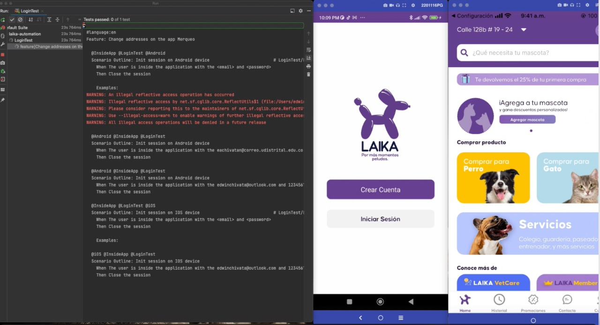

# Laika Automation for Android 📱🐸 and iOS 📱🍎

### Versión 1 Ready!
## En construcción para más features y tests...  🔨

## Tools 💻🛠

---

> Appium, Gherkin, TestNG, Java (POO, SOLID). Design with structure POM (Page Object Model)

---

[App PlayStore](https://play.google.com/store/apps/details?id=com.kubo.laika&hl=es_CO&gl=US)

[App Apple Store](https://apps.apple.com/co/app/laika-la-tienda-de-tu-mascota/id1325285117)

---

---

## Iniciar el proyecto

---
#### ***Iniciar los servidores locales de Appium, uno para Android y el otro para iOS***

`$ appium -p 4723`

`$ appium -p 4724`

---
#### ***En el archivo de Java `src/test/java/Utilities/Env.java` ingresar los datos de tus dispositivos***

---

#### ***Recuerda que para ejecutar este Test debes estar desde una MAC con appium instalado***

---

#### ***Ahora puedes ejecutar los features desde las clases de Java que estan en `src/test/java/Test/`*** ✌

# Dudas

Si tienes una duda acerca del código puedes hacer la pregunta al siguiente correo ***eachivatan@correo.udistrital.edu.co*** con el asunto
***Duda Automatización*** 💪
